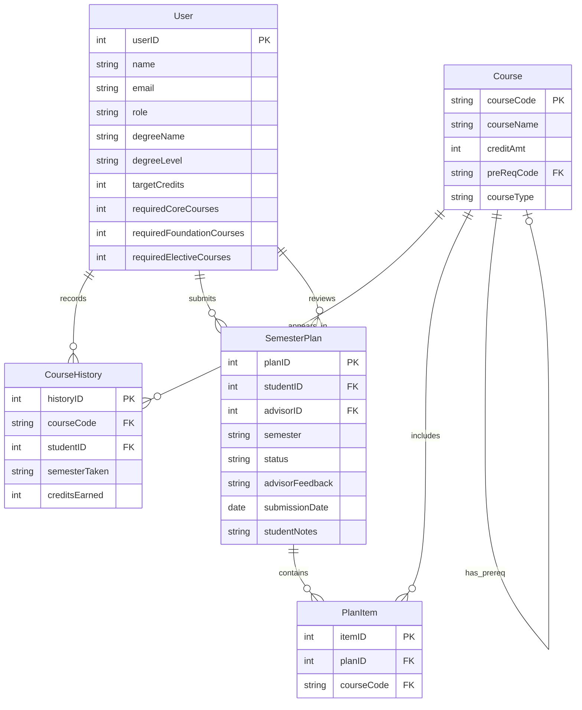

<!-- student-build:skill-integrity
status: pass
root: e84cd692d0b85eefe546385661958c27d07e8be6c5176a82012f68ccff5c8beb
expected_root: e84cd692d0b85eefe546385661958c27d07e8be6c5176a82012f68ccff5c8beb
mismatches: none
-->

# COMP 3613 Assignment 1

Draft this file with the Guide. **Update it after every phase milestone** before you pause. The use-case diagram is a UML PNG at `docs/diagrams/use-case.png`, linked from this file as `diagrams/use-case.png` (path relative to `docs/report.md`). The model diagram is Mermaid. **Embed wireframe images** as `wireframes/<file>` (files live in `docs/wireframes/`).

Do not put your student ID in this file if you will commit it. The PDF cover adds your name and ID at export time.

## Assigned project

MyAdvisor — an app for students to track degree progress, plan semester course
selections, and obtain approval from an administrator / advisor.

## Three workflows

### 1. Track Degree Progress (Student)

### 2. Draft Semester Plan (Student)

### 3. Review and Approve Plan (Advisor)

## Use case diagram

Phase 2 decisions: Student starts Track Degree Progress and Draft Semester Plan;
Advisor starts Review and Approve Plan. Draft Semester Plan includes Submit Plan,
and Review and Approve Plan includes Provide Feedback. No use cases are shared;
both included use cases are required parts of their parent workflows. View Course
History extends Track Degree Progress as an optional student action. View
Submitted Plan is shared by Student and Advisor.

## Model diagram

First draft. Update this section in Phase 5 when polish revises the model, and note what changed.

Assumes the app uses a single `User` table for both students and advisors, distinguished by the `role` field. `SemesterPlan` is owned by a student and may be reviewed by an advisor; `CourseHistory` stores each course completed by a student; `PlanItem` links a plan to a selected course.

## Wireframes

### MyAdvisor overview

<!-- student-build:wireframe-coverage
use_case: Track Degree Progress (Student)
image: docs/wireframes/myAdvisorWireframe2x.png
covered: yes
-->

<!-- student-build:wireframe-coverage
use_case: Draft Semester Plan (Student)
image: docs/wireframes/myAdvisorWireframe2x.png
covered: yes
-->

<!-- student-build:wireframe-coverage
use_case: Review and Approve Plan (Advisor)
image: docs/wireframes/myAdvisorWireframe2x.png
covered: yes
-->

Phase 4 model check: the wireframe confirms the role-based `User` split, the student plan workflow, the advisor feedback loop, and the degree-level metadata shown in the authenticated shell and advisor dashboard. No extra entity is required beyond `User`, `SemesterPlan`, `PlanItem`, `CourseHistory`, and the existing state field set (`status`, `advisorFeedback`, `submissionDate`).

Phase 5 model revision: `User` now stores student-owned academic requirement targets (`requiredCoreCourses`, `requiredFoundationCourses`, and `requiredElectiveCourses`). Students update these values, along with degree name, degree level, and target credits, through the protected Profile workflow. Progress statistics calculate outstanding category counts from these targets and the student's completed course history.

Additional requirements implied by the wireframe but not yet explicit in the model:
- A student can view degree progress, outstanding requirements, and plan history in one dashboard, not just submit a plan.
- A semester plan has a lifecycle: Draft -> Submitted -> Pending Review -> Approved / Rejected.
- The student can revise or resubmit a rejected plan after advisor feedback.
- Each plan item should be validated against course requirements, prerequisites, and available credit totals before approval.
- Advisor review must include both a decision and a written reason/feedback, and the app should retain a review history for each plan.
- Course history should track completed courses per semester and be used to calculate remaining requirements automatically.
- Duplicate course entries and impossible/over-cap credit plans should be prevented before submission.

Accepted model revisions for these requirements:
- `SemesterPlan.status` values should be explicit (`draft`, `submitted`, `under_review`, `approved`, `rejected`).
- `SemesterPlan` should capture `reviewedBy`, `reviewedAt`, and `advisorFeedback` as part of the approval decision trail.
- `PlanItem` should preserve course ordering and allow a plan to show both requested and approved course selections.
- `CourseHistory` should include completion data relevant to progress calculation (`grade`, `semesterTaken`, `creditsEarned`).

## Theming

- **Colours:** clean, neutral palette with semi-dark grey as the main colour and cool blue as the primary accent.
- **Type:** modern sans-serif (`Inter`) throughout.
- **Tone:** professional, clear, and focused on academic planning.
- **Logo / wordmark:** `MyAdvisor`, shown consistently across the landing, login, register, and authenticated shell.
- **UI treatment:** softly rounded corners and restrained shadows.
- **Applied surfaces:** `landing.html`, `login.html`, `register.html`, and the authenticated shell now use the shared MyAdvisor tokens in `app/static/css/app.css`.

## Implementation notes

One named workflow at a time. Include verify notes and polish / model revisions (Phase 5). Do not treat the first build as final.

### Track Degree Progress (Student)

- Implementation choice: dashboard summary with progress metrics, remaining credits, and completed-course requirements.
- The student completed the required SQLModel and thin-route snippets. The route delegates to `AcademicService`; persistence remains in `AcademicRepository`.
- The first implementation adds `Course` and `CourseHistory` tables, a progress repository calculation, a student progress route, and a completed-course dashboard.
- The progress calculation uses the student’s `target_credits` model field rather than a route-level constant.
- Polish revision from student verification: aligned the authenticated shell with the wireframe labels (`Track Progress`, `Plan Semester`, advisor `Dashboard`, and `Manage Requests`), made the sidebar persistent, added username and role above Logout, and added the current-credit progress graph plus requirement summary to the student Home dashboard.
- Further polish: replaced the broken CSS-only graph with an interactive Chart.js line chart, wired `Plan Semester` to its page, and added the Home `View History` action and page.
- Draft Semester Plan now uses five searchable Tom Select dropdown rows, persists selected `PlanItem` records through the repository/service layers, and provides dashboard navigation from History.
- Sidebar polish: the student `Plan Semester` tab now points to the registered `/app/plan-semester` route and highlights when active.
- Plan Semester wireframe polish: the page now opens on `Current Requests` and `Past Requests` tables, includes request number/advisor/date/status columns, and uses `Submit new request` to reveal the detailed course-selection form. Submitted plans are marked `submitted` with a date and return to the list view.
- Further wireframe polish: removed the authenticated welcome header, moved request/history actions to fixed bottom-right floating buttons, and matched the request form to the wireframe with ID/semester metadata, requirement summary, requested-course table, advisor selection, and notes.
- Visual polish from student feedback: matched both floating action buttons to the same neutral styling, added subtle section borders for separation, and centered the two role-specific sidebar navigation buttons.
- Floating-action correction: moved the shared button styles into the authenticated base so both `View History` and `Submit new request` render consistently with the cool-blue primary accent.
- Sidebar polish: vertically centered only the two role-specific navigation buttons while keeping the user identity and Logout controls at the bottom.
- Form polish: the semester request heading displays the degree programme stored on the signed-in account, and the student ID field starts empty with the `816XXXXXX` format placeholder.
- Feedback polish: successful semester submissions now show a dismissible Bootstrap toast after the redirect.
- Request-list polish: current and past request tables now share fixed column widths, and each request number opens a details page showing the submitted semester, status, notes, and selected courses.
- Request-details polish: reshaped the details page to match the wireframe's identity header, submitted-course list, requirements panel, advisor feedback panel, notes area, and cancel/back action.
- Request-details spacing polish: rounded the submitted-course table container and expanded the detail grid, rows, panels, and notes area to use the available card space more closely.
- Request-details layout polish: made the back control a fixed square and gave the details card a viewport-height layout so the course and review sections fill the available page area.
- Request-details table polish: removed the flex-height stretching from the submitted-course list so its five rows retain a compact natural height instead of creating a large empty table area.
- Request-details action polish: anchored the notes and Cancel Request footer to the bottom of the full-height detail card.
- Request-details footer polish: kept the notes at the top of the footer area while pinning only the Cancel Request button to its bottom edge.
- Request-details footer correction: separated the notes and action positioning so the notes remain immediately below the divider while only the Cancel Request button is anchored to the card bottom.
- Advisor workflow milestone: added the advisor request-list screen with submitted student plans grouped into new and outstanding request tables, using repository/service loading and a thin admin route.
- Advisor request-list revision: matched the wireframe columns (`Request No.`, student identity, submission date, status, and actions), separated new submitted requests from past statuses, and kept the advisor request query in the repository layer.
- Advisor review milestone: Review actions now open a protected advisor details page with student identity, submitted courses, outstanding requirements, student notes, and advisor-feedback area.
- Advisor decision milestone: added Approve and Reject actions with advisor feedback persistence, status updates, assignment of the reviewing advisor, and a success toast after redirect.
- Advisor/student detail polish: matched advisor review actions to the shared bottom-right action placement and added bordered student-note panels to both detail views.
- Detail-page spacing polish: expanded the advisor and student detail columns, increased the notes-panel footprint, and used the available card height more effectively while preserving the bottom-right actions.
- Advisor feedback polish: allowed the feedback textarea to expand vertically into the available review-panel space while keeping the decision buttons anchored below it.
- Request lifecycle polish: reviewed requests are now read-only; past requests show View instead of Review, advisor decision controls are removed, and student cancellation is unavailable after approval or rejection.
- Request detail polish: opened advisor requests now display the current status beside the student, ID, and semester metadata.
- Status badge polish: Past Requests now use green for approved responses and red for rejected responses, matching the opened request view.
- Student status polish: the student request-details view now uses the same response colours for approved and rejected requests.
- Student table status polish: the current and past request tables now use the same response colour mapping as the student detail view.
- Advisor-selection validation: semester requests now require a valid advisor selection in the browser and server, persist the selected advisor, and show a warning before an incomplete submission.
- Advisor decision validation: approvals may be submitted without feedback, but rejection requires non-empty feedback in both the browser and service layer.
- Student request cancellation: the Cancel Request control now submits a protected POST action, marks submitted requests as cancelled, preserves them in past history, and blocks cancellation after an advisor response.
- Student form validation polish: blank ID, semester, or advisor fields now receive inline red styling, a brief shake animation, focused correction, and server-side validation.
- Cancellation UI polish: replaced the browser cancellation alert with a Bootstrap confirmation modal and changed the cancel action to a danger-coloured button.
- Advisor request visibility: cancelled student requests are excluded from the advisor request list while remaining available to the student in their own request history.
- Advisor form validation polish: rejecting without feedback now shows inline red styling, a shake animation, and focused feedback guidance before submission; approvals remain valid without feedback.
- Advisor dashboard milestone: added a dedicated Dashboard route with request breakdown metrics, New Requests, and Outstanding Requests over three days; Manage Requests remains a separate workflow.
- Advisor dashboard wireframe polish: reshaped the page into the wireframe's Breakdown panel and full-width New/Outstanding request tables with matching columns and Review actions.
- Sidebar identity polish: student accounts display `Student` and their degree level, while advisor accounts display `Advisor`.
- Degree-level model revision: added `User.degree_level` and seeded Bob as `Level 1`; advisor dashboard request rows and breakdown counts use the stored degree level.
- Semester form layout polish: moved Submit into the right-hand form column and bottom-aligned it with the Additional Notes/Requests field to remove unnecessary overflow.
- Advisor entry-point polish: admin login and authenticated landing-page redirects now open the advisor dashboard by default; `/admin` remains a protected compatibility redirect to the dashboard.
- Advisor request detail polish: outstanding credits and remaining core, elective, and foundation course counts are calculated from the selected student's completed course history and the course catalogue instead of hardcoded values.
- Advisor navigation polish: separated the dashboard entry point from the Manage Requests list at `/admin/requests`; the sidebar button, detail back button, and post-review redirect now open the request list.
- Authentication form polish: login and account creation now use the same custom required-field validation, invalid red styling, shake animation, inline feedback, and automatic focus behavior as the application forms.
- Authentication usability polish: login and account creation include a show-password checkbox that toggles password visibility without changing form validation.
- Authentication navigation polish: replaced the text Home arrow with the same square outlined back-button icon used throughout request detail screens.
- Authentication layout polish: placed the back button and right-aligned MyAdvisor title on one row to reduce unnecessary modal height.
- Final Phase 5 verification: student confirmed the implemented workflows, validation, authentication screens, profile requirements, advisor dashboard, request management, and navigation are working as expected.
- Demo seed data: Bob's Level 1 account is configured for a 93-credit degree with 18 core, 9 foundation, and 12 elective required credits. The seed creates nineteen completed Year 1 courses (57 completed credits, over 60% of the degree) for the progress graph/history view, plus one current submitted request and four older approved, rejected, and cancelled requests. Category progress is calculated in credits, and the seed refreshes Bob's demo history and requests so reruns remain consistent.
- Student profile workflow: students can update degree name, degree level, and target credits through a protected profile page; dashboard and advisor request statistics use the saved academic details dynamically.
- Student requirement tracking: profile settings now store required core, foundation, and elective course counts; outstanding statistics subtract completed courses by category for the selected student.
- Student validation display fix: custom inline feedback now overrides Bootstrap visibility rules and runs before browser-native required-field handling.
- Advisor table polish: reduced the request-table corner radius to a subtler treatment while retaining clipped borders for clean table edges.
- Input validation polish: login usernames are trimmed before authentication, and duplicate course selections are disabled in the form and rejected by the service layer with a visible error message.
- Submission error fix: removed a duplicate `SemesterPlan.advisor_id` declaration introduced while completing the advisor model snippet; the field is now a single optional foreign key so unassigned student requests can be submitted.
- Request identity fix: semester requests now persist the student ID entered in the form separately from the internal account ownership ID, so advisor lists and request details show the submitted `816XXXXXX` value.

<!-- student-build:code-check
workflow: Review and Approve Plan (Advisor)
form: snippet
layer: model
architecture_ok: yes
implement_confidence: 0.90
passed: yes
note: Student completed the SemesterPlan advisor ownership field; the route was reviewed and corrected to load request data through AcademicRepository and AcademicService.
-->

<!-- student-build:code-check
workflow: Draft Semester Plan (Student)
form: choice
layer: other
architecture_ok: yes
implement_confidence: 0.90
passed: yes
note: Student chose hybrid searchable dropdowns: each course field is a dropdown that can be typed into to narrow the course list.
-->

<!-- student-build:code-check
workflow: Draft Semester Plan (Student)
form: snippet
layer: router
architecture_ok: yes
implement_confidence: 0.90
passed: yes
note: Student completed the POST route using AcademicRepository, AcademicService, and a 303 redirect.
-->

<!-- student-build:code-check
workflow: Track Degree Progress (Student)
form: open
layer: other
architecture_ok: yes
implement_confidence: 0.90
passed: yes
note: Student compared the first build with the wireframe and identified sidebar identity, labels, persistence, and missing graph mismatches; polish was applied.
-->

<!-- student-build:code-check
workflow: Track Degree Progress (Student)
form: snippet
layer: model
architecture_ok: yes
implement_confidence: 0.90
passed: yes
note: Student completed CourseHistory fields in app/models/academic.py.
-->

<!-- student-build:code-check
workflow: Track Degree Progress (Student)
form: snippet
layer: router
architecture_ok: yes
implement_confidence: 0.90
passed: yes
note: Student completed a thin route that constructs AcademicRepository and AcademicService and calls get_degree_progress.
-->

## Deployed app

Phase 6. Public Render URL (not localhost). Markers open this to mark the three workflows.

https://faststarter-fmz5.onrender.com/

### Latest deployment status

- **Latest commit:** [`43bb3a4a6abe27998eba70ad09cf90e41b3f34e3`](https://github.com/nirv-exe/comp3613a1/commit/43bb3a4a6abe27998eba70ad09cf90e41b3f34e3) — `Align Level 1 demo seed data`
- **Deployment status:** Successful
- **Health check:** `https://faststarter-fmz5.onrender.com/health` returned `{"ok":true}`
- **Render web service:** Live
- **Render database:** Available

## Logins

Every account a marker needs, including extra users you added. Starter accounts:

- bob / bobpass — regular user
- admin / adminpass — admin

## YouTube URL

## Session transcripts

Filled when the Guide builds the report: the agent writes chat markdown into `docs/transcripts/`; `python manage.py report` packages them.

Guide packaged **7** chat(s) in `docs/transcripts/` (and `docs/transcripts.zip`).

Index: [docs/transcripts/INDEX.md](transcripts/INDEX.md)

- [`phase-1-project`](transcripts/phase-1-project.md)
- [`phase-2-use-cases`](transcripts/phase-2-use-cases.md)
- [`phase-3-model`](transcripts/phase-3-model.md)
- [`phase-4-wireframe`](transcripts/phase-4-wireframe.md)
- [`phase-5-implement`](transcripts/phase-5-implement.md)
- [`phase-6-deploy`](transcripts/phase-6-deploy.md)
- [`render-tools`](transcripts/render-tools.md)

## Competency (student-judge)

Filled by Guide from the student-judge run when this report was built.

**Judged at:** 2026-10-04T16:17:38-04:00  
**Evidence pass:** re-read native Copilot Guide chats for Phases 1–6 and Render tooling, current `docs/report.md`, diagrams, wireframe, routers, and transcript markdown; prior judge ignored.

**Student / session:** Nirav / `comp3613a1`  
**Artifact:** Guide chats for this project (Copilot Agent) and the Guide-written `docs/transcripts` dump  
**Phases in evidence:** 1–6 (COMP 3613; Phase 5 polish, Phase 6 deploy; never generic 0–5)

### Totals

| | Count / value |
|--|--|
| Metrics on rubric | 12 (M1–M12) |
| N/A (excluded) | 0 |
| Metrics scored | 12 |
| Scoreable max | 48 |
| Awarded total | 46 / 48 |
| **Overall (avg of scored)** | **3.8 / 4** |
| Impression mark | 18 / 20 |

## Scorecard

| ID | Metric | Score / 4 | In avg | Evidence |
|----|--------|----------:|:------:|----------|
| M1 | Phase discipline | 4 | yes | The chats follow Phases 1–4 before implementation, then Phase 5 workflow slices and polish before Phase 6. The latest commit and successful deployment are now recorded. |
| M2 | Problem framing | 4 | yes | Student selected MyAdvisor and named three `Feature (user)` workflows, then refined includes, extends, shared `View Submitted Plan`, entities, properties, and wireframe-implied requirements. |
| M3 | Decision ownership | 4 | yes | The student explicitly added and removed use cases, requested the self-referential FK label, and challenged the first advisor design: “the design does not follow the wireframe. Also it shows no requests.” |
| M4 | Artefact-before-code | 4 | yes | The report contains the UML PNG, Mermaid ERD, and embedded wireframe before the implementation notes; the implementation record says it followed the wireframe and accepted model revisions. |
| M5 | Verification habit | 4 | yes | The report records final Phase 5 verification and repeated mismatch-driven fixes, including empty request data, validation, cancellation, navigation, chart behavior, and profile requirements. |
| M6 | Assignment fit | 4 | yes | The shipped routers have no inline `select()`, `db.exec()`, `session.query`, or SQL filter matches; report evidence documents thin routes and service/repository delegation. The latest commit is recorded as successfully deployed. |
| M7 | Slice explanation | 4 | yes | The report records student-completed SQLModel and thin-route checks for Track Degree Progress and Draft Semester Plan, plus a model check for Review and Approve Plan; all recorded checks have `architecture_ok: yes`. |
| M8 | Prompt quality | 4 | yes | The student’s prompts are phase-tagged and concrete, including the use-case relationship edits and the wireframe mismatch request; later prompts efficiently steer specific polish corrections. |
| M9 | Response to pushback | 4 | yes | The student did not accept the first build: they identified wireframe mismatch and missing requests, and the session continued through extensive UI, workflow, validation, and model polish. |
| M10 | Integrity | 4 | yes | No laundering markers or edited-skill evidence were found; `manage.py skills-verify` returned `Skill integrity: pass`, and the student’s decisions remain consistent across the native chats and report. |
| M11 | Provenance continuity | 4 | yes | The final implementation grows from the MyAdvisor workflows, named model, single wireframe, accepted lifecycle requirements, and later verification notes rather than an unrelated product. |
| M12 | Sincerity trajectory | 4 | yes | No suspicion round was needed in the readable Guide chats; no `student-judge:sincerity` blocks were found, so the trajectory is clean with no abandonment. |

## Strengths

- Strong phase progression from student-owned workflows through UML, ERD, wireframe coverage, implementation, polish, and deployment.
- Excellent response to visual and behavioral mismatches; the student repeatedly steered corrections instead of accepting the first build.
- Architecture evidence is strong: recorded snippets passed and the final router search found no inline persistence queries.
- The report captures meaningful domain rules: plan lifecycle, rejection/resubmission, prerequisite and duplicate validation, advisor feedback, progress calculation, and cancellation.
- Skill integrity passed and the transcript set covers the native Copilot Guide chats available for this workspace.

## Gaps (priority order)

1. The report’s YouTube URL section is still empty if a video is required by the course submission checklist.
2. The report’s YouTube URL section is still empty if a video is required by the course submission checklist.

## Phase gate status

| Phase | Status | Note |
|-------|--------|------|
| 1 | met | MyAdvisor and three named workflows recorded. |
| 2 | met | UML use-case PNG includes student-owned include/extend/shared decisions. |
| 3 | met | Mermaid ERD and self-referential Course FK correction recorded. |
| 4 | met | Wireframe embedded and all three workflows marked covered. |
| 5 | met | Theme, build, verification, UI/workflow/model polish, and architecture checks are recorded. |
| 6 | met | Latest commit `43bb3a4a6abe27998eba70ad09cf90e41b3f34e3` is recorded, deployment is successful, and `/health` returned `{"ok":true}`. |

## Recommended next practice

- Reconfirm the deployed revision and database-backed request flow on the public URL, then record one concise marker walkthrough for Track Degree Progress, Draft Semester Plan, and Review and Approve Plan.

## Integrity note

- Clean — no external-assist suspicion was raised, and skill integrity passed.

## Provenance flags

- None.

## Sincerity log summary

- Blocks found: 0 | max round: 0 | min/mean/final confidence: not applicable | trend: clean | cleared: yes

## Skips

- Skips: 0/3 used. No assumptions were recorded as skips.

## Skill integrity

Course skills are hashed at export and compared to `.agents/skills.lock.json`. Do not edit `.agents/skills/`, `.cursor/skills/`, or `AGENTS.md`.

- Status: **pass**
- Root: `e84cd692d0b85eefe546385661958c27d07e8be6c5176a82012f68ccff5c8beb`
- none
